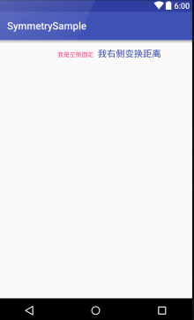

### SymmetryLayout ###
被设计一会在左,一会在右弄的很是蛋疼,于是有了这个小轮子.

**如何使用**
```
    <com.erqi.le.symmetry.SymmetryLayout
        android:layout_width="match_parent"
        android:layout_height="wrap_content"
        app:gravity="center"
        app:gravityLeft="right"
        app:gravityRight="left"
        app:textColorLeft="@color/colorAccent"
        app:textColorRight="@color/colorPrimary"
        app:textLeft="我是左侧固定"
        app:textRight="我右侧变换距离"
        app:textSizeLeft="12sp"
        app:textSizeRight="18sp"/>
```

**效果图**



|属性|类型|默认值|
|-|-|-|
| textColorLeft||`left`|
| gravity|`left`,`right`,`center`|`left`|
|gravityLeft|`top`,`bottom`,`left`,`right`,`center_vertical`,`fill_vertical`,`center_horizontal`,`fill_horizontal`,`center`,`fill`,`clip_vertical`,`clip_horizontal`,`start`,`end`|`left`|
|gravityRight|`top`,`bottom`,`left`,`right`,`center_vertical`,`fill_vertical`,`center_horizontal`,`fill_horizontal`,`center`,`fill`,`clip_vertical`,`clip_horizontal`,`start`,`end`|`left`|